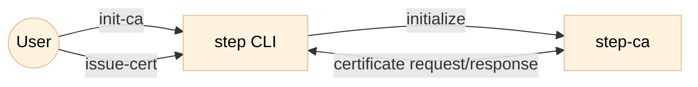
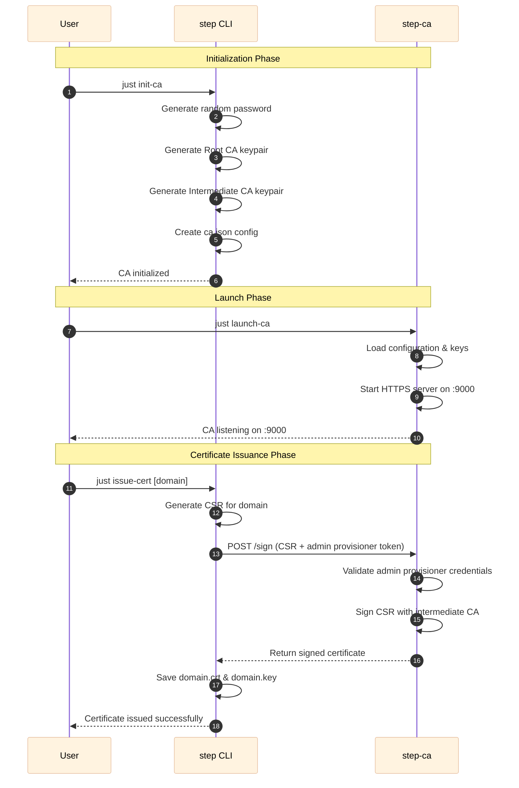

# tutorial-01: Step CA Tutorial

This tutorial demonstrates how to set up Smallstep Certificate Authority (step-ca) using Docker, including CA initialization, certificate issuance, and CA startup. This is the foundational tutorial that introduces the basic concepts of running a private CA with the JWK (admin) provisioner.

---

## Architecture



### Component Roles

- **User**: The administrator who operates the CA through the step CLI.
- **step CLI**: The command-line client used to interact with the CA (initialize, issue certificates).
- **step-ca**: The Certificate Authority server that listens on port 9000 and handles certificate signing requests.

## Sequence



### Sequence Details

1. **just init-ca**: User initiates CA initialization through the `just` command.
2. **Generate random password**: The CLI generates a strong random password for encrypting CA keys.
3. **Generate Root CA keypair**: A self-signed root CA certificate and private key are created.
4. **Generate Intermediate CA keypair**: An intermediate CA (signed by the root) is created with its own keypair.
5. **Create ca.json config**: The CA configuration file is written.
6. **just launch-ca**: User starts the CA server.
7. **Load configuration & keys**: The CA loads its configuration and decrypts the intermediate CA private key.
8. **Start HTTPS server**: The CA begins listening on HTTPS port 9000.
9. **just issue-cert**: User requests a certificate for a domain (default: localhost).
10. **Generate CSR**: The CLI creates a Certificate Signing Request.
11. **POST /sign**: The CLI sends the CSR along with admin provisioner credentials to the CA.
12. **Validate provisioner**: The CA validates the admin (JWK) provisioner credentials.
13. **Sign CSR**: The CA uses the intermediate CA private key to sign the certificate.
14. **Return signed certificate**: The CA sends the signed certificate back to the CLI.
15. **Save certificate files**: The signed certificate and private key are saved to disk.

---

## Prerequisites

- Docker and Docker Compose installed
- [just](https://github.com/casey/just) command runner installed

---

## Quick start

Run the following steps from the `tutorial-01` directory on the host. The workflow uses two terminals running concurrently: one for the **Step CA** container lifecycle, and one for executing commands inside the container. If you want to start from a clean state at any time, run `just cleanup` (WARNING: removes CA config, certs, DB, and secrets).

### 1) Step CA

- Step CA - Terminal 1: launch the step-ca compose stack

```bash
just container step-ca
```

- Step CA - Terminal 2: open a shell in the step-ca container and initialize + launch the CA

```bash
just shell step-ca
# inside the container
just init-ca
just launch-ca
```

**Notes**:
- `just init-ca` generates a random password and initializes the CA files under `config/`, `certs/`, and `secrets/`.
- `just launch-ca` starts `step-ca` and it will listen on `:9000`.

**Generated Files:**
- `/home/step/certs/root_ca.crt` - Root certificate
- `/home/step/certs/intermediate_ca.crt` - Intermediate certificate
- `/home/step/secrets/root_ca_key` - Root private key
- `/home/step/secrets/intermediate_ca_key` - Intermediate private key
- `/home/step/secrets/ca-password` - CA password file
- `/home/step/config/ca.json` - CA configuration file
- `/home/step/config/defaults.json` - Default configuration file

### 2) Issue a Certificate

- Step CA - Terminal 3: open another shell in the step-ca container to issue a certificate

```bash
just shell step-ca
# inside the container
just issue-cert
```

This issues a certificate for `localhost` (default). You can specify a custom domain:

```bash
just issue-cert example.com
```

**Generated Files:**
- `${domain}.crt` - Server certificate (e.g., `localhost.crt`)
- `${domain}.key` - Private key (e.g., `localhost.key`)

---

That's the full quick-start flow: bring up Step CA, initialize it, launch the server, and issue certificates using the admin (JWK) provisioner.

## `just` helper tasks

This project includes a `justfile` with convenience tasks. Current useful targets:

- `just` or `just --list` — list available `just` targets.
- `just cleanup` — remove generated artifacts (`certs`, `config`, `db`, `secrets`) and stop containers.
- `just container <name>` — bring up the compose file `compose-<name>.yml` (e.g., `just container step-ca`).
- `just shell <name>` — open a shell in a running container (e.g., `just shell step-ca`).
- `just init-ca` — initialize the Step CA with auto-generated password (run inside the step-ca container).
- `just launch-ca` — start the step-ca server (run inside the step-ca container).
- `just issue-cert [domain]` — issue a server certificate for the specified domain (default: localhost) using the admin provisioner (run inside the step-ca container).

**Notes**:
- Some tasks are intended to be run from inside the step-ca container (they call `step` and `step-ca` binaries that are available there). Use `just shell step-ca` to access the container before running such tasks.

## Directory Structure

```
tutorial-01/
├── justfile               # Just command definitions
├── compose-step-ca.yml    # Docker Compose configuration file
├── scripts/
│   ├── init-ca.sh        # CA initialization script
│   ├── issue-cert.sh     # Certificate issuance script
│   └── launch-ca.sh      # CA startup script
├── certs/                # Certificate directory
├── config/               # CA configuration directory
├── secrets/              # Password and key files directory
└── db/                   # Database directory
```

## Troubleshooting

### Clean Up and Start Fresh

```bash
just cleanup
just container
```

### Set Script Execution Permissions on Host

```bash
chmod +x scripts/*.sh
```

## CA Configuration

- **CA Name**: tutorial-01 CA
- **DNS**: localhost
- **Listen Address**: :9000 (HTTPS)
- **Deployment Type**: Standalone
- **Default Provisioner**: admin

## References

- [Smallstep Certificates Documentation](https://smallstep.com/docs/certificates/)
- [Step CLI Reference](https://smallstep.com/docs/step-cli/)
