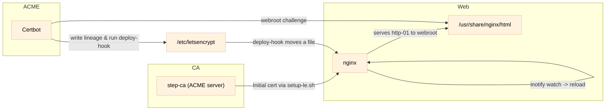
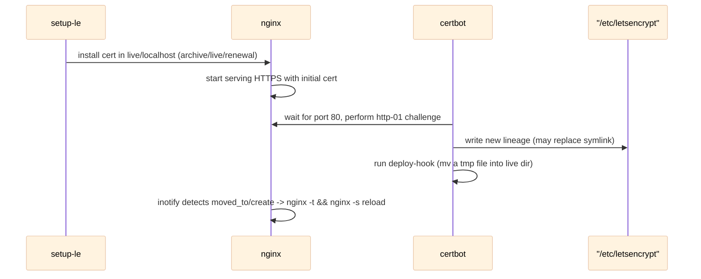

# tutorial-02: ACME + Certbot integration with step-ca

This tutorial demonstrates how to bootstrap a local Smallstep CA, start an Nginx server that presents an initial locally-provisioned certificate, and then let Certbot (ACME client) take over certificate lifecycle management using the local step-ca as an ACME server. In this tutorial Certbot performs validation using the HTTP-01 (webroot) challenge — Nginx serves challenge files from the webroot — which contrasts with DNS-01 workflows (used in other tutorials) that validate domain ownership by creating DNS records instead of serving HTTP challenges.

---

## Architecture




Sequence (renewal adoption):



---

## Quick start

Run the following steps from the `tutorial-02` directory on the host (unless a step explicitly says to run a command inside a container). The workflow uses three roles running concurrently in separate terminals: **Step CA**, **Nginx**, and **Certbot**. Note: the terminal labels used below (e.g., “Step CA - Terminal 1”, “Nginx - Terminal 1”) are *role-scoped* — the Terminal 1 for each role refers to a distinct terminal window. Please open separate terminal windows for each listed terminal. If you want to start from a clean state at any time, run `just cleanup` (WARNING: removes CA config, certs, DB, and the `letsencrypt` directory).

### 1) Step CA (one or more terminals)

- Step CA - Terminal 1: launch the step-ca compose stack

```bash
just container step-ca
```

- Step CA - Terminal 2: open a shell in the step-ca container and initialize + launch the CA

```bash
just shell step-ca
# inside the container
just init-ca
just launch-ca
```

Notes: `just init-ca` generates the provisioner password and initializes the CA files under `config/` and `secrets/`. `just launch-ca` starts `step-ca` and it will listen on `:9000`.

- Step CA - Terminal 3: open another shell in the step-ca container to add the ACME provisioner

```bash
just shell step-ca
# inside the container
just add-acme-provisioner
# verify the provisioner was added.
step ca provisioner list
# set up Let's Encrypt directory structure and initial certs
just setup-le
```

If `step ca provisioner list` shows an ACME provisioner entry, the ACME endpoint is registered successfully.

### 2) Nginx (two terminals)

- Nginx - Terminal 1: bring up the nginx container

```bash
just container nginx
```

- Nginx - Terminal 2: open a shell in the nginx container and verify HTTPS is served

```bash
just shell nginx
# inside the container or on the host (host examples assume you are in tutorial-02)
curl -D - https://localhost
```

Note: if the certificate presented is not trusted by your machine, `curl` may fail verification. You can either (a) add the root CA to your trust store, or (b) temporarily use `curl -k -D - https://localhost` to skip certificate verification for the test.

- Nginx - Terminal 3: check certificate details (serial and validity)

```bash
# on the host (tutorial-02 directory)
step certificate inspect https://localhost --insecure --short
```

Record the displayed serial number and expiration date — you will use these to confirm Certbot actually replaced the cert.

### 3) Certbot (one or more terminals)

- Certbot - Terminal 1: bring up the certbot compose file (it waits for nginx to be ready and then runs the ACME flow)

```bash
just container certbot
```

This runs `certbot certonly --webroot ... --cert-name localhost` against the local step-ca ACME directory. The container also runs the deploy-hook that moves a tiny file into `live/localhost` so the nginx watcher detects the change and reloads.

- Certbot - Terminal 2: re-check the server certificate details to confirm a new cert was installed

```bash
step certificate inspect https://localhost --insecure --short
```

You should see the serial number and/or expiration date changed compared to the value recorded before running certbot. If they differ, Certbot successfully obtained and deployed a new certificate.

---

That's the full quick-start flow: bring up Step CA, run Nginx with the initial cert, then run Certbot to obtain/replace the certificate via HTTP-01. Let me know if you want me to add a `just` target that runs a recommended sequence (e.g., start CA → init → launch → start nginx → run certbot) for convenience.

## Compose files and runtime mapping

| Compose file | Service name | Image | Container name | Entrypoint / Notes |
|--------------|--------------|-------|----------------|-------------------|
| `compose-step-ca.yml` | `tu02-step-ca` | `smallstep/step-ca:latest` | `tu02-step-ca` | Runs `step-ca` (CA server); mounts CA config/certs and provides `just`+scripts in the container. |
| `compose-nginx.yml` | `tu02-nginx` | `nginx:alpine` | `tu02-nginx` | Starts `nginx` and an inotify watcher that reloads when `live/localhost` files/dirs change; serves webroot for http-01. |
| `compose-certbot.yml` | `tu02-certbot` | `certbot/certbot` | `tu02-certbot` | Waits for nginx on port 80, runs `certbot certonly --webroot ... --cert-name localhost` and executes deploy-hook to touch/move a file into live dir. |

---

## Key implementation details

- `setup-le.sh` installs an **initial certificate in a certbot-compatible layout** (`archive/localhost`, `live/localhost`, `renewal/localhost.conf`). It extracts the chain (or copies `fullchain`) so Certbot finds the expected files.
- `compose-certbot.yml` runs Certbot with `--cert-name localhost` so Certbot can reuse the `localhost` lineage instead of creating `localhost-0001`.
- `scripts/certbot-deploy-hook.sh` is the deploy-hook run by Certbot; it writes a small temp file and atomically moves it to `live/localhost` to generate an inotify `moved_to/create` event.
- `compose-nginx.yml` runs Nginx and an inotify-based watcher that watches `live/localhost` for `create,moved_to,modify,attrib,close_write` and runs `nginx -t && nginx -s reload` on events while logging the result.

## Files & scripts (short reference)

- `compose-step-ca.yml` – step-ca (ACME provider) compose file
- `compose-nginx.yml` – nginx container + inotify watcher
- `compose-certbot.yml` – certbot container that talks to the local ACME server
- `scripts/setup-le.sh` – creates initial certs in certbot layout and a minimal renewal file
- `scripts/certbot-deploy-hook.sh` – deploy-hook to trigger nginx watcher reliably

## Directory layout (major files)

```
tutorial-02/
├── compose-step-ca.yml        # step-ca (ACME server)
├── compose-nginx.yml          # nginx + watcher (reload on cert changes)
├── compose-certbot.yml        # certbot client configured to use local ACME directory
├── justfile                   # helper tasks for init, launch, cleanup and container orchestration
├── scripts/
│   ├── setup-le.sh            # creates initial certbot-compatible layout
│   └── certbot-deploy-hook.sh # deploy-hook to trigger nginx watcher
├── nginx/
│   ├── conf/
│   │   └── default.conf
│   └── html/                  # webroot used for http-01 challenge
├── letsencrypt/               # host-backed storage mounted into containers
│   ├── etc/letsencrypt/
│   │   ├── live/
│   │   ├── archive/
│   │   └── renewal/
│   └── var/log/letsencrypt/
├── certs/
├── config/
└── db/
```

---

## `just` helper tasks

This project includes a `justfile` with convenience tasks. Current useful targets:

- `just` or `just --list` — list available `just` targets.
- `just cleanup` — remove generated artifacts (`certs`, `config`, `db`, `letsencrypt`, `secrets`).
- `just container <name>` — bring up the compose file `compose-<name>.yml` (e.g., `just container nginx` runs `docker-compose -f compose-nginx.yml up`).
- `just shell <name>` — open a shell in a running container (e.g., `just shell nginx`).
- `just init-ca` — initialize the Step CA (generates the provisioner password; run inside the step-ca container).
- `just launch-ca` — start the step-ca server (runs `step-ca` with the config and password file).
- `just add-acme-provisioner` — register the ACME provisioner in the CA config and signal step-ca to reload.

Notes:
- Some tasks are intended to be run from inside the step-ca container (they call `step` and `step-ca` binaries that are available there). Use `just shell step-ca` to access the container before running such tasks.

---


## Rationale

This approach makes sure a web server can present HTTPS immediately and then have Certbot take over certificate renewal and reloading cleanly. The three key items are: (1) a certbot-compatible initial layout, (2) `--cert-name` to instruct Certbot which lineage to use, and (3) a robust deploy-hook + watcher handshake to guarantee nginx reloads.

---

If you'd like, I can add a short checklist or `just` tasks to automate the start order.
