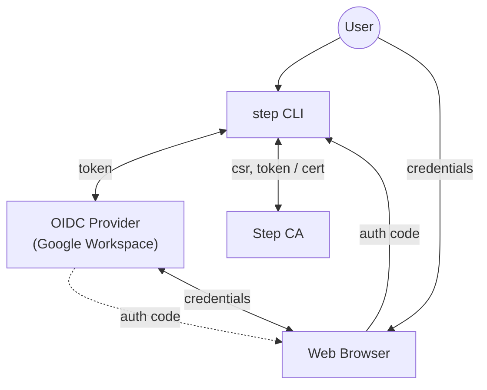
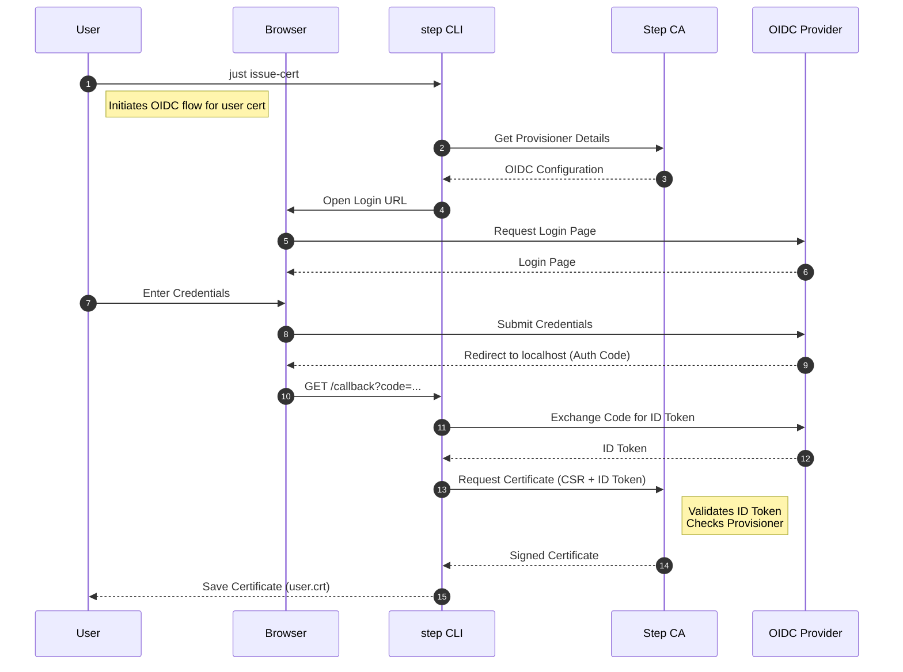

# tutorial-03: OIDC provisioner (Google Workspace)

This tutorial demonstrates how to configure Smallstep Certificate Authority (step-ca) to use an OIDC provisioner backed by Google Workspace (or another OIDC provider) so identities from your organization can request user certificates for client authentication.

**Note**: OIDC provisioners issue certificates for **people** (user/client certificates), not for servers. The certificate contains the authenticated user's identity (email, URI) in the Subject Alternative Names, not arbitrary domain names.

---

## Goal

- Configure an OIDC provisioner and register it in the CA.
- Use the OIDC provisioner to request a user certificate (client certificate) for authentication.
- Learn how OIDC-based authentication works in the certificate issuance flow.

## Architecture



### Component Roles

- **User**: The human operator who initiates the command and provides credentials for authentication.
- **step CLI**: The command-line client that acts as the OIDC client. It initiates the flow, handles the callback, exchanges the auth code for an ID token, and requests a certificate from the CA.
- **Web Browser**: The user interface for interacting with the OIDC provider. It handles the login page display and redirects the authorization code back to the CLI.
- **OIDC Provider (Google Workspace)**: The identity provider that authenticates the user and issues the ID token.
- **Step CA**: The Certificate Authority that validates the ID token and issues the X.509 certificate.

## Sequence



### Sequence Details

- **1. just issue-cert**: The user initiates the user certificate issuance process using the `just` command, which invokes the `step` CLI.
- **2-3. Get Provisioner Details**: The `step` CLI contacts the Step CA to retrieve configuration details for the OIDC provisioner (e.g., Client ID, Issuer URL).
- **4. Open Login URL**: The CLI opens the system's default web browser to the OIDC provider's login page.
- **5-6. Request Login Page**: The browser requests the login page from the OIDC provider (Google Workspace).
- **7-8. Enter & Submit Credentials**: The user enters their credentials (username/password) in the browser, which are submitted to the OIDC provider.
- **9-10. Redirect & Callback**: Upon successful authentication, the OIDC provider redirects the browser to a localhost callback URL (listened to by the `step` CLI), passing a one-time **Authorization Code**.
- **11-12. Exchange Code for ID Token**: The `step` CLI receives the code and exchanges it with the OIDC provider for an **ID Token** (JWT).
- **13. Request Certificate**: The CLI generates a Certificate Signing Request (CSR) and sends it, along with the ID Token, to the Step CA.
- **14. Signed Certificate**: The Step CA validates the ID Token (checking signature and issuer) and, if valid, signs the CSR. The certificate will contain the user's identity (email, URI) from the ID Token in the SANs.
- **15. Save Certificate**: The `step` CLI saves the newly issued user certificate and key to disk.

## Prerequisites

- Docker and Docker Compose installed
- A Google Workspace account (or another OIDC provider) and the ability to create OAuth/OIDC client credentials
- The `step` CLI (available inside the container in this tutorial)
- `just` command runner

> Note: This tutorial uses interactive steps that require you to create OAuth client credentials (Client ID and Client Secret) for your OIDC provider. The README below provides example commands and placeholders where you should substitute values from your OIDC provider.

---

## Quick start

1. Start the container:

```bash
just container step-ca
```

2. Connect to the container:

```bash
just shell step-ca
```

3. Initialize the CA (inside the container):

```bash
just init-ca
```

4. Launch the CA (inside the container):

```bash
just launch-ca
```

5. Register the OIDC provisioner (inside the container):

- Create OAuth client credentials in Google Cloud Console (or your OIDC provider) as a "Web application".
- Set the redirect URI to `https://localhost:9000/oidc/callback` (or the OIDC callback URI your CA expects).
- Copy `CLIENT_ID` and `CLIENT_SECRET` from the OAuth client you created.

Then run (replace placeholders with your values):

```bash
export CLIENT_ID="<your-client-id>"
export CLIENT_SECRET="<your-client-secret>"
export DOMAIN="<your-domain>"
just add-oidc-provisioner
```

6. Request a user certificate using the OIDC provisioner (inside the container):

```bash
just issue-cert
```

Follow the interactive flow: your browser will be opened (or a URL displayed) where you authenticate to your OIDC provider (Google Workspace). After successful authentication the `step` CLI will receive the identity token and complete the user certificate issuance. The certificate will contain your authenticated identity (email, URI) in the SANs, not arbitrary domain names.

---

## Files and scripts

- `justfile` — Task runner configuration
- `compose-step-ca.yml` — Docker Compose file to run the step-ca container
- `scripts/add-oidc-provisioner.sh` — (Called by `just`) Script to add an OIDC provisioner
- `scripts/issue-cert.sh` — (Called by `just`) Script to request a user certificate using the OIDC provisioner
- `config/` — directory where CA config will be stored
- `certs/`, `db/` — data directories (persisted on host)

**Make scripts executable on the host if necessary:**

```bash
chmod +x scripts/*.sh
```

---

## Security notes

- Do not commit client secrets or private keys to source control. Store secrets in a secret manager for production workflows.
- This tutorial is intended for learning and local testing only.

---

## Troubleshooting

- If `step ca provisioner list` does not show the OIDC provisioner after adding it, ensure `step-ca` was reloaded (SIGHUP is sent by our scripts) and check the CA server logs.
- If the browser login fails, check that the OAuth client redirect URI matches the one configured in your provider.