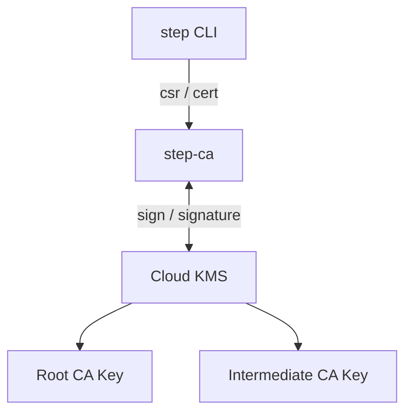
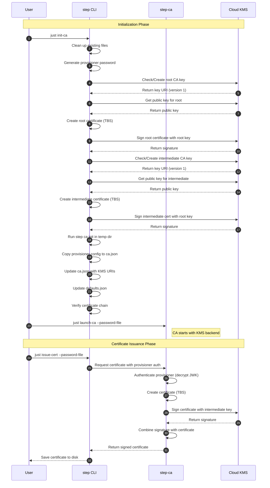

# tutorial-04: Cloud KMS key management

This tutorial demonstrates how to configure Smallstep Certificate Authority (step-ca) to use Google Cloud KMS for protecting root and intermediate CA private keys. Instead of storing private keys on the filesystem, the CA uses GCP Cloud KMS to perform signing operations, providing stronger key protection suitable for production deployments.

---

## Goal

- Protect root and intermediate CA private keys using Google Cloud KMS
- Initialize a step-ca instance that uses KMS-backed keys for all signing operations
- Issue certificates using a CA whose keys never touch the local filesystem
- Learn best practices for production-grade key management with Cloud KMS

## Why use Cloud KMS?

**Security benefits:**
- Private keys never leave the KMS security boundary
- Fine-grained access control via IAM
- Audit logging for all key operations
- Key rotation and versioning capabilities

**Operational benefits:**
- Disaster recovery - keys are backed up automatically by GCP
- Meet compliance requirements for key protection

---

## Architecture



### Component Roles

- **step CLI**: The command-line client that requests certificates from the CA.
- **step-ca**: The Certificate Authority server that processes certificate requests and coordinates with Cloud KMS for signing operations.
- **Cloud KMS**: Google's cloud-based key management service that stores private keys and performs cryptographic signing operations.
- **Root CA Key**: The root certificate authority's private key, stored in Cloud KMS and used to sign the intermediate certificate.
- **Intermediate CA Key**: The intermediate certificate authority's private key, stored in Cloud KMS and used to sign end-entity certificates.

## Sequence



### Sequence Details

**Initialization Phase:**
- **1. just init-ca**: The user runs the `just init-ca` command, which executes the initialization script.
- **2. Clean up existing files**: The script removes any previous CA files (`certs/`, `config/`, `db/`, `secrets/`) without prompting.
- **3. Generate provisioner password**: A random password is generated for encrypting the JWK provisioner's private key.
- **4-5. Check/Create root CA key**: The script checks if root key version 1 exists in KMS. If not, it creates a new key using `step kms create`.
- **6-7. Get public key for root**: The script retrieves the public key for the root CA key from Cloud KMS using `step-kms-plugin key`.
- **8. Create root certificate (TBS)**: `step certificate create --profile root-ca --no-password --insecure` creates a self-signed root certificate structure.
- **9-10. Sign root certificate**: The certificate is sent to Cloud KMS to be signed with the root private key. The signature is returned and combined with the certificate.
- **11-12. Check/Create intermediate CA key**: Similar to the root key, checks for version 1 or creates a new intermediate key.
- **13-14. Get public key for intermediate**: Retrieves the public key for the intermediate CA key from Cloud KMS.
- **15. Create intermediate certificate (TBS)**: `step certificate create --profile intermediate-ca --no-password --insecure` creates the intermediate certificate structure.
- **16-17. Sign intermediate cert**: The intermediate certificate is sent to Cloud KMS to be signed with the root private key.
- **18. Run step ca init in temp dir**: `step ca init` runs in a temporary directory to generate the JWK provisioner configuration (encrypted with the password from step 3).
- **19. Copy provisioner config**: The provisioner configuration from the temp `ca.json` is copied to `/home/step/config/ca.json`.
- **20. Update ca.json with KMS URIs**: The script updates `ca.json` to use KMS-backed certificates and keys, and adds the KMS configuration block.
- **21. Update defaults.json**: The script updates the fingerprint in `defaults.json` to match the actual root certificate.
- **22. Verify certificate chain**: The script verifies that the intermediate certificate is properly signed by the root.
- **23. just launch-ca --password-file**: The user starts the CA server. The `--password-file` flag allows non-interactive startup by providing the provisioner password automatically.

**Certificate Issuance Phase:**
- **24. just issue-cert --password-file**: The user runs the issue-cert script with automatic password provisioning.
- **25. Request certificate with provisioner auth**: step CLI sends a certificate request to step-ca, authenticating with the admin provisioner.
- **26. Authenticate provisioner**: step-ca decrypts the JWK provisioner's private key using the password file to authenticate the request.
- **27. Create certificate (TBS)**: step-ca creates a "to be signed" certificate structure from the request.
- **28. Sign certificate with intermediate key**: step-ca sends the TBS hash to Cloud KMS to be signed with the intermediate private key.
- **29. Return signature**: Cloud KMS performs the signing operation and returns the signature. The private key never leaves Cloud KMS.
- **30. Combine signature with certificate**: step-ca combines the signature with the certificate data to create the final signed certificate.
- **31. Return signed certificate**: step-ca sends the completed certificate back to step CLI.
- **32. Save certificate to disk**: step CLI saves the certificate and private key files to the current directory.

---

## Prerequisites

### Required

- Docker and Docker Compose installed
- A Google Cloud Platform account and project
- `gcloud` CLI installed and configured on your host machine
- Permissions to:
  - Create Cloud KMS keyrings
  - Create and manage service accounts
  - Grant IAM roles to service accounts
- Internet connectivity for the container to access Cloud KMS APIs

### Optional

- `just` command runner (available on host, also included in the container)

### About step-kms-plugin

The `step-kms-plugin` (version v0.11.7) is automatically installed in the Docker container during build. This plugin is required for:
- Creating keys in Cloud KMS during initialization
- Generating certificates signed by Cloud KMS keys

The plugin is downloaded from the [smallstep/step-kms-plugin](https://github.com/smallstep/step-kms-plugin) GitHub repository and supports both x86_64 (amd64) and ARM64 architectures.

---

## Quick start

### 1. Set up GCP environment variables

On your host machine, set the required GCP environment variables. These will be used both for the setup script and automatically passed to the container:

```bash
# Set your GCP project ID (required)
export GCP_PROJECT_ID="your-project-id"

# Set the keyring name (required)
# Use a unique name to avoid conflicts with other users
export GCP_KEYRING="your-unique-keyring-name"

# Set the Cloud KMS location (optional, defaults to us-west2 if not specified)
# For production, choose a regional location close to your step-ca server
export GCP_LOCATION="us-west2"
```

**Note**: These environment variables will be automatically passed to the Docker container via docker-compose, so you won't need to set them again inside the container. The `GCP_LOCATION` variable is optional and will default to `us-west2` if not set.

### 2. Set up Cloud KMS keyring and service account

Run the setup script to create the Cloud KMS keyring and service account:

```bash
# From the tutorial-04 directory on the host
# Default: creates a service account with a random name (e.g., step-ca-kms-a1b2c3d4)
just setup-service-account

# Or specify a custom service account name
just setup-service-account my-custom-sa-name
```

The script will:
- Enable the Cloud KMS API
- Create a Cloud KMS keyring (if it doesn't exist)
- Create a service account with the following IAM roles (at keyring level):
  - `roles/cloudkms.cryptoOperator` - For signing operations with KMS keys
  - `roles/cloudkms.viewer` - For viewing public keys
- Download the service account key to `gcp-credentials.json` (in the tutorial-04 directory)

**Important Notes**:
- The service account name includes a random suffix by default to avoid conflicts when multiple people follow this tutorial
- The credentials file is saved to the tutorial-04 root directory (NOT in `secrets/` which gets cleaned up by `just cleanup`)
- The credentials file is automatically gitignored
- If a credentials file already exists, you'll be prompted to overwrite, save with a timestamp, or skip
- GCP limits each service account to 10 keys - the script will check this quota before creating a new key
- The CA private keys themselves (root and intermediate) will be created later in Cloud KMS using `step kms create`
- When you start the container, Docker will fail if `gcp-credentials.json` doesn't exist, alerting you immediately

### 3. Build and start the container

The container needs to be built with the `step-kms-plugin` for Cloud KMS support:

```bash
# From the tutorial-04 directory on the host
just container step-ca
```

This will build a custom Docker image that includes:
- The base `smallstep/step-ca` image
- The `step-kms-plugin` binary for Cloud KMS integration

### 4. Connect to the container

In a new terminal:

```bash
just shell step-ca
```

### 5. Initialize the CA with Cloud KMS

Inside the container, initialize the CA. The GCP environment variables from step 1 are already available:

```bash
# Initialize the CA with Cloud KMS-backed keys
just init-ca
```

The initialization script will perform the following steps:

1. **Clean up existing files** - Automatically removes any previous CA files without prompting
2. **Generate CA password** - Creates a random password for the JWK provisioner
3. **Create root CA key in Cloud KMS** using `step kms create` (or reuses existing key version 1)
4. **Generate root CA certificate** using `step certificate create --no-password --insecure` with the Cloud KMS key
5. **Create intermediate CA key in Cloud KMS** using `step kms create` (or reuses existing key version 1)
6. **Generate intermediate CA certificate** signed by the root key using `step certificate create --no-password --insecure`
7. **Initialize step-ca** in a temporary directory to generate the JWK provisioner configuration
8. **Update ca.json** to reference the Cloud KMS-backed certificates and keys
9. **Update defaults.json** with the correct root certificate fingerprint
10. **Verify** the certificate chain and KMS connection

**Note**: The `--no-password --insecure` flags are used for certificate creation because the private keys are stored in Cloud KMS and don't need local password protection. This is the standard approach when using KMS-backed keys.

**Generated files:**
- `/home/step/certs/root_ca.crt` - Root certificate (public key)
- `/home/step/certs/intermediate_ca.crt` - Intermediate certificate (public key)
- `/home/step/config/ca.json` - CA configuration (with Cloud KMS URIs)
- `/home/step/config/defaults.json` - Default configuration
- `/home/step/secrets/ca-password` - JWK provisioner password (used automatically)

**Keys in Cloud KMS (not on filesystem):**
- Root CA private key: `projects/.../cryptoKeys/step-ca-root-key/cryptoKeyVersions/1`
- Intermediate CA private key: `projects/.../cryptoKeys/step-ca-intermediate-key/cryptoKeyVersions/1`

### 6. Verify Cloud KMS integration

```bash
just verify-kms
```

This will display the Cloud KMS configuration from `ca.json` and confirm that the CA is using Cloud KMS-backed keys.

### 7. Launch the CA

```bash
just launch-ca
```

The CA will start and listen on `:9000`. You'll see log messages indicating it's using Cloud KMS for signing operations.

### 8. Issue a certificate

In another terminal (or background the CA with Ctrl+Z / bg), run:

```bash
just shell step-ca

# Inside the container
just issue-cert localhost
```

The certificate will be issued **without prompting for a password** - the script automatically uses the password stored in `/home/step/secrets/ca-password`.

The certificate will be issued and signed using the intermediate CA key stored in Cloud KMS. The private key operation (ECDSA signing) happens entirely within Cloud KMS - the key material never touches the step-ca container or filesystem.

**Generated files:**
- `localhost.crt` - Server certificate
- `localhost.key` - Server private key (this is the server's key, not the CA key)

**Note**: You can also specify a different domain name:
```bash
just issue-cert example.com
```

---

## How it works

### Shared utilities (common.sh)

All scripts in this tutorial share common functionality through `scripts/common.sh`, which provides:

- **Environment validation**:
  - `check_env_vars()` - Validates that required environment variables are set
  - `check_gcp_credentials()` - Verifies the GCP credentials file exists and is readable
  - `check_file_exists()` - Generic file existence checker with custom error messages

- **GCP KMS operations**:
  - `ensure_kms_keyring()` - Creates a KMS keyring if it doesn't exist, or verifies it exists
  - `random_hex()` - Generates random hexadecimal strings for unique naming

- **Output formatting**:
  - `print_success()` - Green checkmark messages for successful operations
  - `print_error()` - Red error messages
  - `print_warning()` - Yellow warning messages
  - `print_header()` - Formatted section headers
  - `print_subheader()` - Formatted subsection headers
  - `print_env_usage()` - Displays required environment variables

These functions ensure consistent error handling, validation, and user feedback across all scripts.

### Error handling and key version detection

The initialization script (`init-ca-kms.sh`) uses robust error handling to manage KMS key creation:

**Key version detection logic**:
1. The script first attempts to use existing key version 1 (most common case)
2. It temporarily disables `set -e` to prevent immediate exit on error
3. Runs `step-kms-plugin key` to check if the key version exists
4. Captures both stdout and stderr with `2>&1` for detailed error reporting
5. Re-enables `set -e` after checking the exit code

**Key creation flow**:
- If version 1 exists: Uses it directly
- If version 1 doesn't exist:
  - Displays the error message from step-kms-plugin for debugging
  - Creates a new key using `step kms create --json`
  - Parses the JSON output to extract the version number using `grep -o 'cryptoKeyVersions/[0-9]*'`
  - Falls back to version 1 if parsing fails

**Debug information on errors**:
When key creation fails, the script provides comprehensive debug output:
- The full error message from the `step kms create` command
- The KMS URI being used
- The key path being created
- The credentials file location

This approach ensures that users get actionable error messages when something goes wrong, rather than cryptic failures.

### Key creation with step-kms-plugin

The `step-kms-plugin` is a separate binary that extends `step` CLI with Cloud KMS support. It enables:
- Creating asymmetric signing keys in Cloud KMS using `step kms create`
- Using Cloud KMS keys to sign certificates with `step certificate create --kms`

The plugin is required for the initialization process but is NOT needed at runtime - `step-ca` has built-in Cloud KMS support.

### Cloud KMS URI formats

There are two URI formats used in this tutorial:

**1. KMS connection URI** (used in `--kms` flag):
```
cloudkms:credentials-file=/path/to/credentials.json
```

**2. Key resource URI** (used to reference specific keys):
```
projects/PROJECT_ID/locations/LOCATION/keyRings/KEYRING/cryptoKeys/KEY_NAME/cryptoKeyVersions/VERSION
```

Example key URI:
```
projects/my-project/locations/global/keyRings/step-ca-keyring/cryptoKeys/step-ca-root-key/cryptoKeyVersions/1
```

### CA configuration

After initialization, the `ca.json` file is updated to use Cloud KMS:

```json
{
  "root": "/home/step/certs/root_ca.crt",
  "crt": "/home/step/certs/intermediate_ca.crt",
  "key": "projects/.../cryptoKeys/step-ca-intermediate-key/cryptoKeyVersions/1",
  "kms": {
    "type": "cloudkms",
    "uri": "cloudkms:credentials-file=/home/step/gcp-credentials.json"
  }
}
```

Key points:
- `root` and `crt`: Point to certificate files (public keys)
- `key`: Points to the Cloud KMS key URI (private key location)
- `kms.type`: Specifies the KMS provider type
- `kms.uri`: Specifies the KMS connection URI with credentials

### Authentication

**Cloud KMS Authentication:**
step-ca authenticates to Cloud KMS using a service account key file. The path is specified in:
1. The `kms.uri` field in `ca.json`
2. The `GOOGLE_APPLICATION_CREDENTIALS` environment variable (set in docker-compose.yml)

**Provisioner Password:**
The CA also requires a password to decrypt the JWK provisioner's private key (stored encrypted in `ca.json`). This is different from the KMS keys:

| Component | Storage Location | Password Required? | Notes |
|-----------|------------------|-------------------|-------|
| Root CA private key | Cloud KMS | ❌ No | Protected by GCP IAM, no local password |
| Intermediate CA private key | Cloud KMS | ❌ No | Protected by GCP IAM, no local password |
| JWK Provisioner private key | `ca.json` (encrypted) | ✅ Yes | Used for ACME/JWK authentication |

**Password file usage:**
- **Generated during**: `just init-ca` → creates `/home/step/secrets/ca-password`
- **Used by**: `just launch-ca` and `just issue-cert` (automatically via `--password-file` flag)
- **Purpose**: Decrypt the JWK provisioner's private key when the CA starts or issues certificates

This automated password handling eliminates the need for interactive password entry during normal operations.

### Signing flow

When step-ca needs to sign a certificate:

1. step-ca creates a certificate to be signed (TBS - "to be signed")
2. step-ca sends the TBS hash to Cloud KMS via API
3. Cloud KMS signs the hash with the private key (which never leaves Cloud KMS)
4. Cloud KMS returns the signature
5. step-ca combines the signature with the certificate data

This ensures the private key material never exists outside of Cloud KMS.

---

## Directory structure

```
tutorial-04/
├── compose-step-ca.yml         # Docker Compose file for step-ca with Cloud KMS config
├── justfile                    # Task runner configuration
├── gcp-credentials.json        # GCP service account key (gitignored, mounted to container)
├── scripts/
│   ├── common.sh              # Shared utility functions
│   ├── init-ca-kms.sh         # Initialize CA with Cloud KMS-backed keys
│   ├── issue-cert.sh          # Issue a server certificate
│   ├── setup-service-account.sh  # Create GCP service account and credentials
│   └── verify-kms.sh          # Verify Cloud KMS integration
├── certs/                     # Public certificates (generated by init, gitignored)
├── config/                    # CA configuration (generated by init, gitignored)
├── db/                        # CA database (generated by init, gitignored)
└── secrets/                   # Provisioner passwords (generated by init, gitignored)
    └── ca-password            # JWK provisioner password
```

---

## Cleanup

If you need to remove all generated files and start over:

```bash
# Inside the container
just cleanup
```

This will:
- Stop and remove the step-ca container
- Delete all generated files in `config/`, `certs/`, `db/`, and `secrets/` directories

**Note**: This does NOT delete the KMS keys in Google Cloud. To completely clean up:

```bash
# On the host machine, delete the KMS keys
gcloud kms keys versions destroy 1 \
  --key=step-ca-root-key \
  --keyring=$GCP_KEYRING \
  --location=$GCP_LOCATION

gcloud kms keys versions destroy 1 \
  --key=step-ca-intermediate-key \
  --keyring=$GCP_KEYRING \
  --location=$GCP_LOCATION
```

---

## Troubleshooting

### Service account key quota exceeded

**Error message**:
```
ERROR: Service account already has 10 keys (GCP limit).
You need to delete some old keys before creating a new one.
```

**Solution**:
```bash
# List existing keys
gcloud iam service-accounts keys list \
  --iam-account=your-service-account@your-project.iam.gserviceaccount.com

# Delete old keys (keep key ID from the list above)
gcloud iam service-accounts keys delete KEY_ID \
  --iam-account=your-service-account@your-project.iam.gserviceaccount.com
```

### Credentials file not found

**Error message**:
```
ERROR: GCP credentials file not found at /home/step/gcp-credentials.json
```

**Solution**:
1. Make sure you ran `just setup-service-account` on the host machine
2. Verify the credentials file exists: `ls -l gcp-credentials.json`
3. If the container fails to start with a mount error, it means `gcp-credentials.json` doesn't exist in the tutorial-04 directory

### Permission denied when creating keys

**Error message**:
```
Error creating root key:
ERROR: (gcloud.kms.keys.create) PERMISSION_DENIED: Permission denied on resource...
```

**Solution**:
1. Verify your service account has the required roles at the keyring level:
```bash
gcloud kms keyrings get-iam-policy $GCP_KEYRING \
  --location=$GCP_LOCATION \
  --filter="bindings.members:serviceAccount:YOUR_SA@$GCP_PROJECT_ID.iam.gserviceaccount.com" \
  --flatten="bindings[].members" \
  --format="table(bindings.role)"
```

2. If the roles are missing, add them:
```bash
# Add cryptoOperator role
gcloud kms keyrings add-iam-policy-binding $GCP_KEYRING \
  --location=$GCP_LOCATION \
  --member="serviceAccount:YOUR_SA@$GCP_PROJECT_ID.iam.gserviceaccount.com" \
  --role="roles/cloudkms.cryptoOperator"

# Add viewer role
gcloud kms keyrings add-iam-policy-binding $GCP_KEYRING \
  --location=$GCP_LOCATION \
  --member="serviceAccount:YOUR_SA@$GCP_PROJECT_ID.iam.gserviceaccount.com" \
  --role="roles/cloudkms.viewer"
```

### KMS API not enabled

**Error message**:
```
ERROR: Cloud KMS API is not enabled
```

**Solution**:
```bash
gcloud services enable cloudkms.googleapis.com --project=$GCP_PROJECT_ID
```

The `setup-service-account.sh` script should enable this automatically, but you can run it manually if needed.

### Invalid keyring or project ID

**Error message**:
```
ERROR: Keyring 'projects/.../keyRings/...' not found
```

**Solution**:
1. Verify your environment variables are set correctly:
```bash
echo $GCP_PROJECT_ID
echo $GCP_KEYRING
echo $GCP_LOCATION
```

2. Create the keyring if it doesn't exist:
```bash
gcloud kms keyrings create $GCP_KEYRING \
  --location=$GCP_LOCATION
```

### step-kms-plugin not found

**Error message**:
```
bash: step-kms-plugin: command not found
```

**Solution**:
This means the Docker image wasn't built correctly. Rebuild the container:
```bash
# Remove old image
docker-compose -f compose-step-ca.yml down
docker rmi tutorial-04-step-ca

# Rebuild with --no-cache to ensure step-kms-plugin is downloaded
docker-compose -f compose-step-ca.yml build --no-cache
docker-compose -f compose-step-ca.yml up
```

---

## Security best practices

### Credentials management

1. **Never commit credentials to git**: The `.gitignore` excludes `gcp-credentials*.json` files
2. **Credentials persistence**: The `gcp-credentials.json` file is in the tutorial-04 root directory and is NOT deleted by `just cleanup`, so you can safely clean up and reinitialize the CA without losing your GCP credentials
3. **Rotate service account keys**: Regularly rotate the service account keys (GCP recommends every 90 days)
4. **Least privilege**: Grant only the minimum required IAM roles to the service account

### Key management

1. **Enable key rotation**: Cloud KMS supports key versioning for rotation
2. **Separate root and intermediate keyrings**: For production, consider using separate keyrings with different access controls
3. **Audit logging**: Enable Cloud Audit Logs for Cloud KMS to track all key operations

### Network security

1. **VPC Service Controls**: Use VPC-SC to create a security perimeter around Cloud KMS
2. **Private Service Connect**: Access Cloud KMS via Private Service Connect endpoints

---

## References

- [Smallstep KMS Documentation](https://smallstep.com/docs/step-ca/cryptographic-protection/)
- [GCP Cloud KMS Documentation](https://cloud.google.com/kms/docs)
- [Step CLI KMS Integration](https://smallstep.com/docs/step-cli/reference/kms/)
- [step-ca Configuration Reference](https://smallstep.com/docs/step-ca/configuration/)
